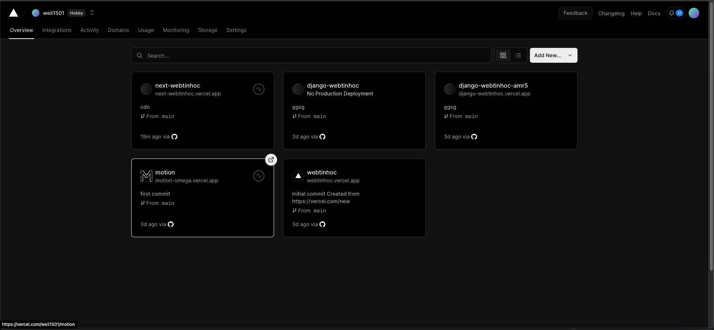
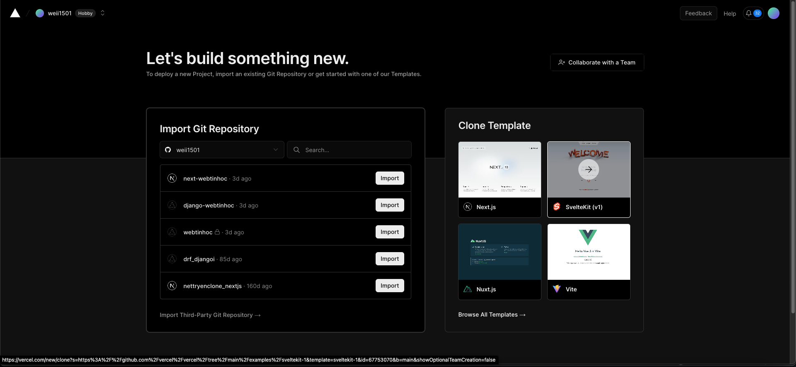
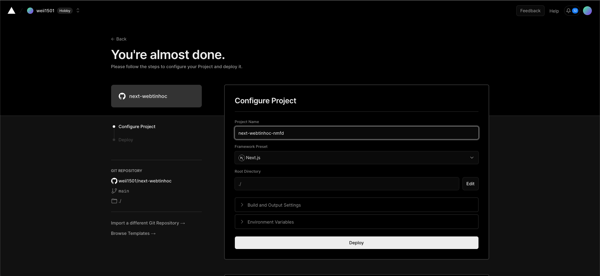
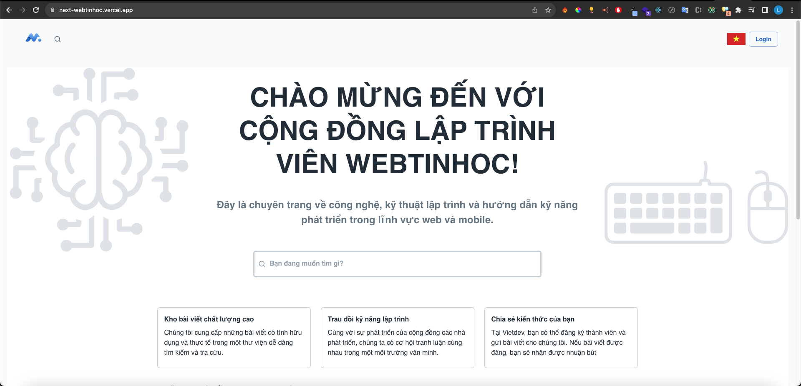

# Hướng dẫn deploy Nextjs App lên Vercel
## 1. Nội dung bài viết
Ở bài viết này, mình sẽ hướng dẫn các bạn deploy một ứng dụng Nextjs lên Vercel.
Nội dung bài viết sẽ bao gồm:
- Mô tả dự án
- Các bước deploy
- Kết luận
## 2. Mô tả dự án
- Dự án này sử dụng Nextjs để tạo ra một trang forum để đọc báo về Tin học. 
Ngoài ra, người dùng khi đăng ký tài khoản thì có thể viết các bài chia sẻ, đặt
câu hỏi cho từng chủ đề để giải đáp thắc mắc, hiện tại vẫn đang trong gia đoạn phát triền.
- Các công nghệ sử dụng:
    - Nextjs
    - Reactjs
    - Redux
    - Material-ui
    - Javascript
    - Vercel
    - Github
    - Git
- Bạn có thế tạo dự án riêng với những biến môi trường của bạn trên file .env
- Cách set up dự án hoặc chạy dự án tùy thuộc vào yêu cầu và cách làm của bạn.
## 3. Các bước deploy
### 3.1. Tạo tài khoản Vercel
- Đầu tiên, các bạn truy cập vào trang chủ của Vercel tại địa chỉ: https://vercel.com/
- Sau đó, các bạn đăng ký tài khoản Vercel bằng tài khoản Github hoặc Gitlab.
Lưu ý rằng: Hãy đăng nhập vào tài khoản mà bạn chứa repository của dự án.
- Sau khi đăng nhập thành công, các bạn sẽ thấy giao diện như sau:

### 3.2. Tạo dự án Nextjs
- Đầu tiên, các bạn tạo một dự án Nextjs bằng cách sử dụng lệnh sau:
```bash
yarn create next-app next-webtinhoc
```
- Tôi đãn làm ra một dự án riêng, nên các bạn có thể tạo dự án riêng của mình. hoặc có thể tham khảo dự án của tôi tại đây:
  https://github.com/weii1501/next-webtinhoc.git
- Cây thư mục của dự án này:
```forder
|_____mocks
|_____apis
|_____components
|_____hooks
|_____pages
|_____public
|_____reducers
|_____styles
|_____theme
|_____utils
|_____actions.js
|_____constants.js
|_____createEmotionCache.js
|_____loader.js
|_____README.md
|_____next.config.js
|_____next-18next.config.js
|_____package.json
|_____store.js
|_____postcss.config.js
|_____yarn.lock
```
    
- Bên trong khá nhiều phần tôi đã làm. Bạn có thể tham khảo ở link trên. Bạn có thể tham khảo file next.config.js của tôi để biết cách cấu hình nextjs:
```js
/** @type {import('next').NextConfig} */
require('dotenv').config()
const path = require('path')
const isProd = process.env.NODE_ENV === 'production'
const { i18n } = require('./next-i18next.config')

const nextConfig = {
  i18n,
  reactStrictMode: false,
  compiler: {
    emotion: true
  },
  env: {
    spaceID: process.env.spaceID,
    accessTokenDelivery: process.env.accessTokenDelivery
  },
  distDir: 'build',
  trailingSlash: true,
  assetPrefix: isProd ? 'https://cdn.next-webtinhoc.vercel.app' : undefined,
  images: {
    domains: [
      'localhost',
      '127.0.0.1'
    ]
  },
  modularizeImports: {
    lodash: {
      transform: 'lodash/{{member}}'
    },
    antd: {
      transform: 'antd/{{member}}'
    },
    '@mui/icons-material': {
      transform: '@mui/icons-material/{{member}}'
    }
  },
  webpack: (config) => {
    config.resolve.fallback = { fs: false }
    config.module.rules.forEach((rule) => {
      const { oneOf } = rule
      if (oneOf) {
        oneOf.forEach((one) => {
          if (!`${one.issuer?.and}`.includes('_app')) return
          one.issuer.and = [path.resolve(__dirname)]
        })
      }
    })
    return config
  }
}

const plugins = [
]

module.exports = () => {
  return plugins.reduce((acc, next) => next(acc), {
    ...nextConfig
  })
}
```
- Bạn có thể tham khảo file next-i18next.config.js của tôi để biết cách cấu hình nextjs:
```js
/** @type {import('next-i18next').UserConfig} */
module.exports = {
  i18n: {
    defaultLocale: 'vi',
    locales: ['en', 'vi'],
    localeDetection: false
  }
}
```
- Các biến môi trường tôi sử dụng:
```env
NEXT_PUBLIC_DJANGO_BASE_URL=http://127.0.0.1:8000
NEXT_PUBLIC_SITE_BASE_URL=http://localhost:3000
NEXT_PUBLIC_DEBUG=false
NEXT_PUBLIC_DEFAULT_AVATAR=/images/avatar-default.png
NEXT_PUBLIC_AUTH_TOKEN=YWRtaW5AZW1haWwuY29tOjE=
NEXT_PUBLIC_AUTH_TOKEN_GUEST=dm9kYWNsdWMxNUBnbWFpbC5jb206MTUwMTIwMDE=
#NEXT_PUBLIC_AUTH_TOKEN=dm9kYWNsdWNAZW1haWwuY29tOjE=
NEXT_PUBLIC_DEFAULT_IMAGE_STORY=/images/novel/default-image.jpg
  NEXT_PUBLIC_DJANGO_BASE_WS=ws://127.0.0.1:8000/api/
NEXT_PUBLIC_GOOGLE_CLIENT_ID=856942969950-nt09nre5h95f9nrjplh1o58urb4rklah.apps.googleusercontent.com
NEXT_PUBLIC_GOOGLE_SECRET_KEY=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
```
- Lưu ý rằng khi deploy trên vercel file này không có tác dụng. Bạn phải set up lại biến môi trường trên vercel.
### 3.3. Deploy dự án lên Vercel
- Đầu tiên, các bạn truy cập vào trang chủ của Vercel tại địa chỉ: https://vercel.com/
- Sau đó, các bạn đăng nhập vào tài khoản Vercel của mình.
- Tiếp theo, các bạn chọn Add New... -> Project
- Sau đó, các bạn chọn Import Git Repository:



- Bạn chọn repository của mình. Sau khi đã chọn, sẽ hiện ra giao diện như sau:



- Các trường bạn cần phải điền trong quá trình deploy:
  - **Project Name**: Đăt tên cho dự án của bạn.
  - **Framework Preset**: Chọn framework mà bạn sử dụng. Ở đây tôi chọn **Next.js**.
  - **Root Directory**: Đường dẫn đến thư mục chứa dự án của bạn. Ở đây tôi để mặc định.
  - **Build and Output Settings**: Lệnh để build dự án của bạn
    - **Build Command**: Lệnh để build dự án của bạn. Ở đây tôi để mặc định.
    - **Output Directory**: Thư mục chứa dự án sau khi build. Ở đây tôi để làm 'build'.
    - **Install Command**: Lệnh để cài đặt các package của dự án. Ở đây tôi để mặc định.
  - **Environment Variables**: Các biến môi trường của dự án. Nếu dự án của bạn có sử dụng các biến môi trường thì bạn cần phải điền vào đây.
- Cuối cùng nhấn vào nút Deploy. Sau khi deploy thành công, bạn sẽ nhận được đường dẫn của dự án. Ở đây là: https://next-webtinhoc.vercel.app/



- Lưu ý: Khi deploy lên Vercel, các bạn cần phải set up lại các biến môi trường của dự án. Vì các biến môi trường của dự án sẽ không được lưu trên Vercel. Các bạn có thể tham khảo cách set up biến môi trường của dự án tại đây: https://vercel.com/docs/environment-variables

## 4. Kết luận

- Trên đây là hướng dẫn cách deploy dự án Nextjs lên Vercel. Hy vọng qua bài viết này sẽ giúp các bạn có thể deploy dự án của mình lên Vercel một cách dễ dàng.
- Nếu quá trình deploy có lỗi xảy ra, hãy đọc lỗi và chỉnh sửa code sau đó push lên lại. Sau đó, các bạn vào lại trang Vercel và nhấn vào nút **Redeploy** để deploy lại dự án.
- Nếu các bạn có thắc mắc gì thì có thể để lại comment bên dưới. Tôi sẽ cố gắng trả lời các bạn sớm nhất có thể. Chúc các bạn thành công!
